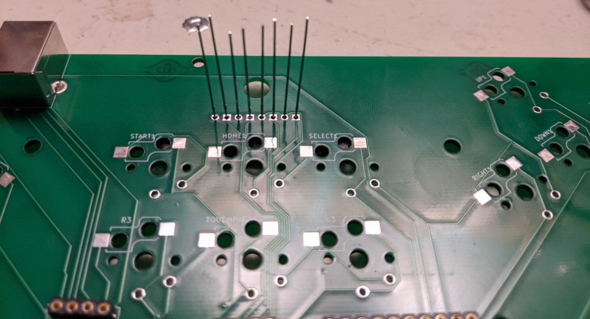

# mino

An open source fightboard made to be cheap, be compatible, and give your thumbs some options.

## Description

mino is a fightboard built from the ground up with ergonomics and flexibility in mind. The goal is to encourage comfortable play at an affordable price, and give a good deal of flexibility on how to handle your motion inputs. Inputs are handled with low profile mechanical switches, and the board is compatible with any Brook fighting board.

## Getting Started

### Acquiring PCBs

Currently, acquiring a board means getting it printed and assembled by yourself! mino is composed of two boards, a base plate and a pcb, in theory, you only need the pcb, but the base plate helps to keep everything nice and tidy. In the future I may offer PCBs or full kits through a website, but this is currently up in the air. For getting the pcb printed, I recommend going through [JLCPCB](https://jlcpcb.com), their minimum order quantity is 5 per pcb, so share the love with a friend, or others in the community!

### Acquiring Components

Below is a list of the components I've used to assemble my mino, but there is definitely room for flexibility here.

| Item         | Website/Link     | Part Number | Quantity |
|--------------|-----------|------------|------------|
| Brook Wireless Fighting Board | [Arcade Shock](https://arcadeshock.com/products/brook-ps3-ps4-switch-pc-wireless-fighting-board)      | N/A        |1 |
| PS3 Battery | [Arcade Shock](https://arcadeshock.com/products/sony-ps3-controller-battery-3-7v-1800mah?_pos=1&_sid=7e64b5296&_ss=r) | N/A | 1|
| USB Type-B Cable| [Arcade Shock](https://arcadeshock.com/products/usb-a-to-b-10ft-cable?_pos=1&_sid=ae0756121&_ss=r) | N/A|1|
|4-40 Machine Screw and 4-40 Nut Set| [Arcade Shock](https://arcadeshock.com/products/4-40-machine-screw-and-4-40-nut-set)|N/A|1|
|Kailh Choc Low Profile Switch| [MKUltra](https://mkultra.click/choc-switches) | N/A|22|
|Kailh Choc Keycaps | [MKUltra](https://mkultra.click/kailh-choc-keycaps) |N/A|22|
|Standoff Spacers| [Amazon](https://smile.amazon.com/HVAZI-320pcs-Standoffs-assortment-Male-Female/dp/B06XKWDSPT)|N/A|1|
|Double Sided Tape| [Amazon](https://smile.amazon.com/Reusable-Removable-Washable-Traceless-Clear-16-5ft/dp/B07VHB291T)|N/A|1|
|Bumpons| [Amazon](https://smile.amazon.com/Ehanmu-Self-Adhesive-Rubber-Bumpons-Diameter/dp/B08B5CRXPG)|N/A|4|
|Player LEDs| [Digikey](https://www.digikey.com/)|BL-BGE1V1|4|
|4 Position Receptacle Connector 2.00mm| [Digikey](https://www.digikey.com/)|831-47-004-10-001000|1|
|8 Position Receptacle Connector 2.00mm| [Digikey](https://www.digikey.com/)|831-47-008-10-001000|1|
|4 Position Receptacle Connector 2.54mm| [Digikey](https://www.digikey.com/)|801-47-004-10-002000|1|
|20 Position Receptacle Connector 2.54mm| [Digikey](https://www.digikey.com/)|803-47-020-10-002000|1|
|USB Type-B Connector| [Digikey](https://www.digikey.com/)|SS-52300-001|1|

### Required Tools

Assembly of your mino will require some soldering and desoldering skills. There are only through hole components, however, so it's nothing too tough, and should be suitable for a first timer to accomplish. You should only need the following:

* Soldering Iron
* Solder Sucker or Desoldering Wick
* Solder
* Liquid Flux Pen (recommended but not strictly required)

## Assembly

To put your mino together, you'll need to follow these steps:

* Using a pair of needle-nosed pliers, remove the white plastic from the angled connectors on your Brook board, circled below. 
* Using the same pair of pliers, straighten out the now bare pins, so they are pointing straight up, as shown below. 
* Using your soldering iron, and desoldering method of your choice; carefully remove the existing USB-B connector from your Brook board. 
* Set aside your Brook board, and solder your Receptacle Connectors to the underside of the main PCB as shown here, you will need to clip the 8 position connector down to a 5 position connector with a pair of scissors or a wire trimmer. It can be helpful to tape these components in place in order to get them soldered on straight. 
* Ensure that your Brook board can be slotted into these newly soldered connectors from below, then remove the board and set it back aside. 
* Solder the USB-B Connector to the underside of the main PCB as shown here. 
* Flip the board over and solder in the LEDs, then trim the legs. The long end of the LED should go through the square hole. 
* Place and solder your switches as indicated on the board, you could also solder on hotswap sockets, but that won't be covered here. 
* If using a wireless board, connect the antenna and battery to your Brook board, then reattach your Brook board to the main PCB, and if desired, use the 4-40 nut and screw set to fasten the far ends of the Brook board to the PCB.
* If using a wireless board, connect the antenna to the main PCB, and attach the battery somewhere with the double sided tape.
* Fasten your main board to the base using the standoffs.
* Attach bumpons to the bottom of your board.

## Goals

Current short and long term goals for the project:

* Add optional position switches for toggleable features on the Brook board
* Improve ergonomics of the board in hands (consider a more Alice shaped board?)
* Add optional headphone jack to the bottom of the PCB
* Create an optional switch plate for a cleaner look (would also allow for nice top facing switches for any toggles, instead of side mount)
* Add support for PS5 module
* Create a PCB version for full size switches
* Remove dependence on Brook boards
* Adjust the WASD cluster to mimic finger claw placements, similar to the righthand side
* Add a physical power switch
* Create a 3d printable case to optionally hide the bare pcb look

## FAQ

Why are the keys at the angles they're at?
* I printed out paper copies at different angles until I hit something that worked well for where I would be placing the controller on my desk (between two halves a keyboard).

Why full switches for start/select/home etc.?
* I find it more comfortable pressing a full key, rather than a simple momentary switch. And given how often I reset in training mode, I figure the payoff will be worth it.

Why design primarily around the wireless board?
* I'm a scrub so the latency difference doesn't bother me, and I play primarily on PC so I don't need the huge amount of compatability offered by other boards. I have tested with a Universal board and as expected the pin headers are in the same spots, so it should be universal to all Brook boards.

What's with the weird number of directional buttons?
* I personally have trouble doing dragon punch inputs on 2P, my thumb is more dextrous than my ring finger, thus being able to hit left with my thumb is advantageous. The second right button is mostly to enable some additional flexibility, and the additional WASD up is simply because I find some inputs easier on WASD.

Why isn't there currently a switch plate?
* Prototyping is expensive and ordering an extra PCB with literally just holes cut in it was getting expensive. Theoretically all that needs to be done to create one is to copy the board pcb and replace the footprints with some properly sized edge cuts, plus add some edge cuts to make room for the solder bits from the receptacle connectors and USB-B connector. With that the plate and board should sit flush which will allow the switches to be soldered deep enough. Currently it's low priority until other major revisions are made.

Why mino?
* My initial thoughts of the design would have made it shaped like a big T tetromino. That got tossed pretty quick but the name stuck.

## Contributing

Feel free to fork and open a PR to add new features improve ergonomics, add additional control options, etc. This is my first hardware project so I'm sure there's room for improvement.

## License

This project is licensed under the CC BY-SA 4.0 License - see the LICENSE.md file for details

## Acknowledgments

* [keyswitches.pretty](https://github.com/daprice/keyswitches.pretty)
* [KiCad](https://www.kicad.org/)
* [Freerouting](https://freerouting.org/)